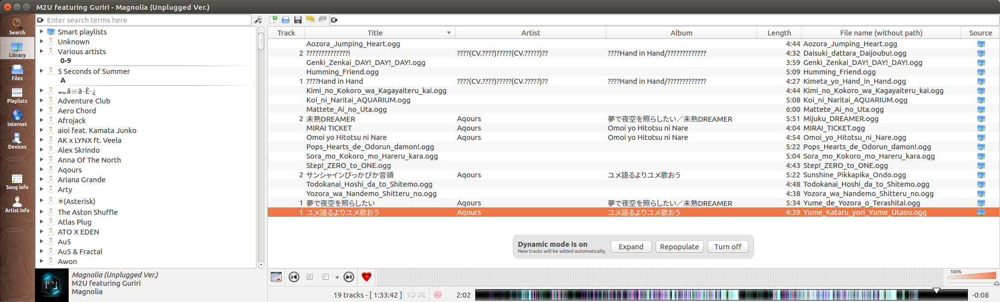

Example Usage 1
==============

I have a bunch of Aquors songs downloaded from the wiki. They are named random things, but their filenames have some format.

First I get rid of the underscores from the file names

Then I set Artist/Album Artist to be Aquors, and set the format to be %t, which means the song name will be of the format:

<song title>.<file extension>

The result is all the songs being organized and named correctly. 
